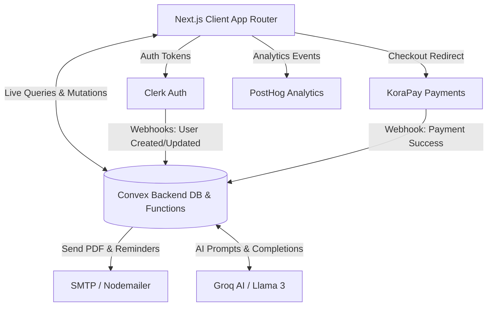
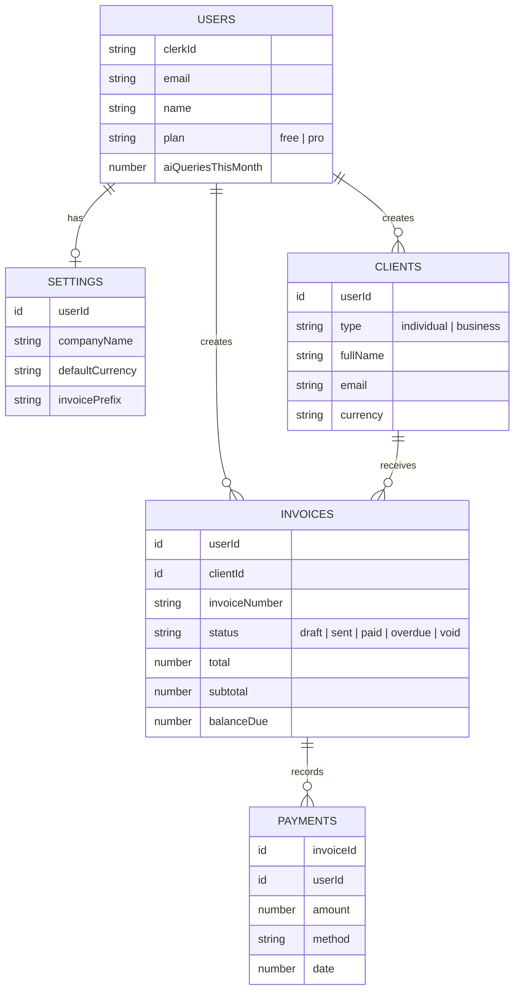
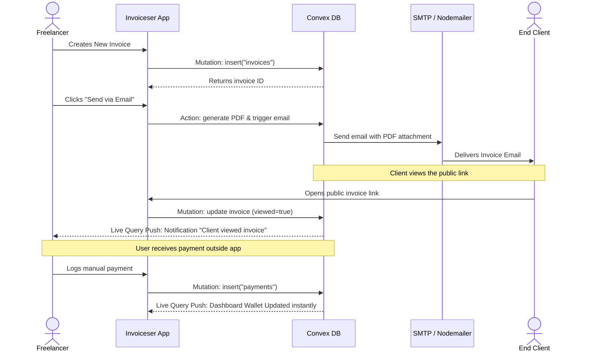
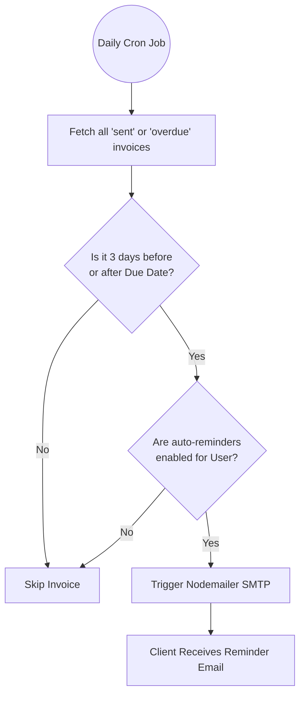

# Architecture & System Design

This document outlines the technical architecture, user flows, and data relationships powering the Invoiceser application.

## 1. System Architecture

Invoiceser is built on a modern, serverless stack designed for real-time reactivity and high performance.

### Core Components
- **Client**: Next.js 14 App Router, styled with Tailwind CSS and shadcn/ui.
- **Backend/DB**: Convex provides real-time WebSockets. When a client views an invoice, the DB updates, and Convex pushes the new state instantly to the user's dashboard.
- **AI Integration**: Groq provides ultra-fast LLM inference, using system prompts injected with the user's Convex invoice data to answer questions.
- **Analytics**: PostHog is integrated on the client-side to track feature usage, interactions, and user journeys to drive data-informed product decisions.
- **Email Delivery**: Standard SMTP via Nodemailer (supporting Gmail and other providers) for reliable delivery of PDFs and scheduled reminders.

---

## 2. Entity Relationship Diagram (Data Schema)

The database consists of the following primary tables in Convex.

---

## 3. Core User Flows

### 3.1 Invoice Creation & Payment Flow

This flow illustrates how a freelancer creates an invoice, how the client interacts with it, and how the system reacts in real-time.

### 3.2 Automated Payment Reminders Flow

Invoiceser uses Convex Cron Jobs to automatically remind clients of due payments without manual intervention.

