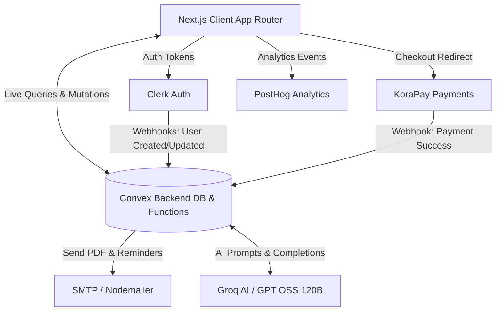
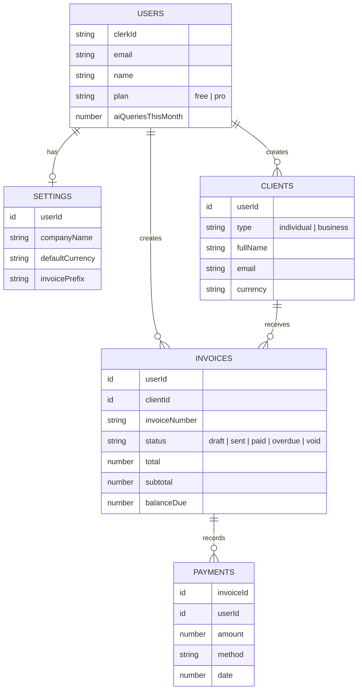
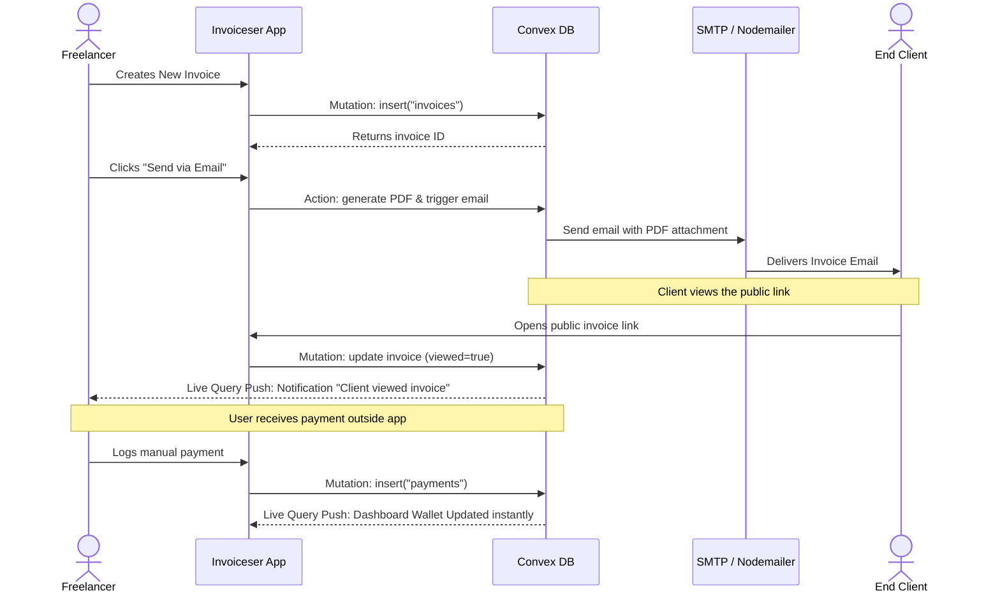
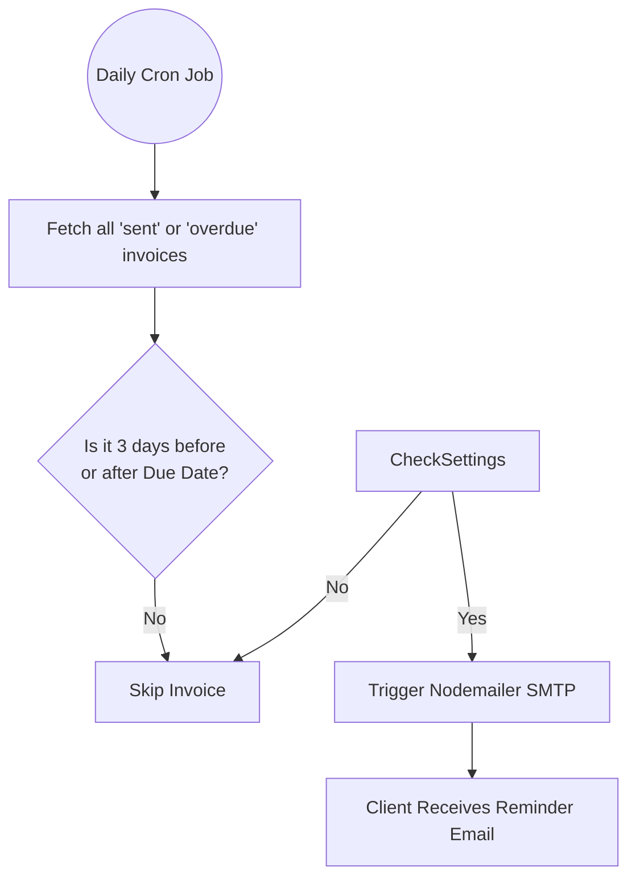

# Architecture & System Design

This document outlines the technical architecture, user flows, and data relationships powering the Invoiceser application.

## 1. System Architecture

Invoiceser is built on a modern, serverless stack designed for real-time reactivity and high performance.

### Core Components
- **Client**: Next.js 14 App Router, styled with Tailwind CSS and shadcn/ui.
- **Backend/DB**: Convex provides real-time WebSockets. When a client views an invoice, the DB updates, and Convex pushes the new state instantly to the user's dashboard.
- **AI Integration**: Groq provides ultra-fast LLM inference, using system prompts injected with the user's Convex invoice data to answer questions.
- **Analytics**: PostHog is integrated on the client-side to track feature usage, interactions, and user journeys to drive data-informed product decisions.
- **Email Delivery**: Standard SMTP via Nodemailer (supporting Gmail and other providers) for reliable delivery of PDFs and scheduled reminders.

---

## 2. Entity Relationship Diagram (Data Schema)

The database consists of the following primary tables in Convex.

---

## 3. Core User Flows

### 3.1 Invoice Creation & Payment Flow

This flow illustrates how a freelancer creates an invoice, how the client interacts with it, and how the system reacts in real-time.

### 3.2 Automated Payment Reminders Flow

Invoiceser uses Convex Cron Jobs to automatically remind clients of due payments without manual intervention.

---

## 4. Security & Authentication Model

Invoiceser employs a strictly decoupled, highly secure authentication architecture utilizing Clerk for identity and Convex for authorization.

### Authentication Handshake
1. The user authenticates securely via Clerk.
2. Clerk issues a cryptographically signed JSON Web Token (JWT).
3. The Next.js client passes this JWT to the Convex backend over WebSocket.
4. Convex verifies the JWT signature against Clerk's public keys.

### Row-Level Security (RLS)
Data isolation is guaranteed at the database level. Every Convex query and mutation executes an identity check. Queries strictly filter by `userId` before ever returning data to the client, making cross-tenant data leakage impossible.

---

## 5. State Management & Reactivity

Invoiceser intentionally avoids heavy client-side state management libraries like Redux or Zustand.

Instead, the architecture relies exclusively on **Convex Live Queries**. 
- The Convex WebSocket maintains an open connection.
- When a database table changes (e.g., a webhook records a payment), Convex immediately pushes the update to the client.
- The UI automatically re-renders with the fresh data, guaranteeing the dashboard is never out of sync.

---

## 6. AI Subsystem (Groq)

The AI Assistant is built using Groq for ultra-low latency inference. 

### Context Injection Architecture
To answer specific questions about a user's business without training a custom model, we utilize a real-time context injection pattern:
1. The user submits an analytical query via the UI.
2. Convex securely retrieves the user's clients, invoices, and settings.
3. The backend serializes this private data into JSON and injects it into a strict, read-only system prompt.
4. The Groq LLM evaluates the prompt and streams the analytical response back to the client.
